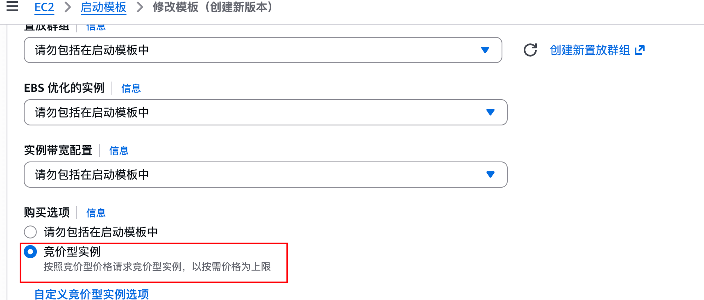

# 注意事项

**r2 配置**

deploy.sh 中的 upload_to_r2 函数负责将 clash 配置传至 r2

请自行安装 rclone 并设置 rclone 与 r2 的配置
- https://github.com/rclone/rclone/releases
- https://dash.cloudflare.com/ 的 r2


```
rclone config
s3
Cloudflare R2 Storage
xxxxxxxxxxxxx
xxxxxxxxxxxxxxxxxxxxxxxxxxxxxxxxxxxxxxx
https://xxxxxxxxxxxxxxxxxx.r2.cloudflarestorage.com
auto

rclone lsf r2:test
```

**请自行替换 deploy.sh 中 upload_to_r2 函数的配置下载地址**

对应
```
echo "url : https://这里改成你的 r2 地址/proxyfile/aws-config.yaml"
```

**区域配置**

aws 开启 ap-east-1 (香港) 区域


**launch_template 配置**

自行替换 main.tf 中的 launch_template id 值


这个按你场景需求进行修改

```
launch_template {
        id = "这个改成你的 launch_template id 值"
    }
```

**spot实例**

需要在launch_template时配置



若启动场景报错，可能原因
1. 未替换 main.tf 中的 launch_template id 值
2. 与 aws api 网络连接超时
3. aws 该区域售罄或下架 instance_type 的配置机型
4. 启动模板中的安全组未开放公网访问
5. rclone配置不正确
6. r2 存储桶名称和配置不一致